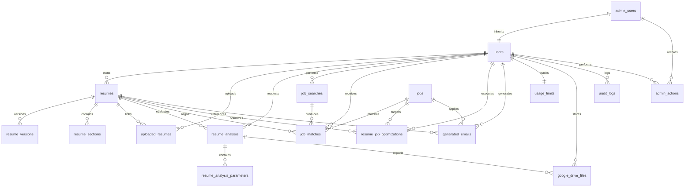

# TrustFlow AI - Database Architecture & Migration Specification

This document details the database architecture, schema definitions, entity relationships, and migration system for **TrustFlow AI**.

---

## 1. Environment Configuration

Database connection parameters are loaded strictly from environment variables using `mysql2/promise` connection pooling:

| Variable Name | Description | Default / Example |
|---|---|---|
| `DB_HOST` (or `MYSQL_HOST`) | MySQL Server Hostname | `localhost` |
| `DB_PORT` (or `MYSQL_PORT`) | MySQL Port | `3306` |
| `DB_NAME` (or `MYSQL_DATABASE`) | Database Name | `trustflow_ai` |
| `DB_USER` (or `MYSQL_USER`) | MySQL User | `root` |
| `DB_PASSWORD` (or `MYSQL_PASSWORD`) | MySQL Password | `your_password` |
| `DB_CONNECTION_LIMIT` | Maximum Pool Connections | `10` |
| `DB_QUEUE_LIMIT` | Max Queued Requests | `0` |
| `DB_WAIT_FOR_CONNECTIONS` | Pool Wait Flag | `true` |
| `ADMIN_EMAIL` | Administrator Email for Seeding | `admin@trustflow.ai` |
| `ADMIN_PASSWORD` | Administrator Password for Seeding | *(Loaded from ENV)* |

---

## 2. Mermaid Entity Relationship (ER) Diagram



---

## 3. Migration Commands Summary

All migration workflows are executed via standard npm scripts:

```bash
# Create database if not exists
npm run db:create

# Execute pending migrations
npm run db:migrate

# Inspect migration status table
npm run db:status

# Verify database schema integrity
npm run db:verify

# Seed administrator account
npm run db:seed

# Master Setup (Create -> Migrate -> Seed -> Verify)
npm run db:setup

# Test database connection (SELECT 1)
npm run db:test
```

---

## 4. Migration Execution Tracking (`schema_migrations`)

All migration scripts are executed in numerical sequence (`000` to `016`). Every successful migration is recorded in `schema_migrations`:

```sql
CREATE TABLE IF NOT EXISTS schema_migrations (
    id INT AUTO_INCREMENT PRIMARY KEY,
    migration_name VARCHAR(255) NOT NULL UNIQUE,
    executed_at TIMESTAMP DEFAULT CURRENT_TIMESTAMP,
    checksum VARCHAR(64) NULL
);
```

Running migrations repeatedly is non-destructive and safely idempotent.

---

## 5. Schema Summary & Table Specifications

1. **`users`**: User identity, role (`USER`, `ADMIN`), plan type (`FREE`, `PREMIUM`), authentication, and ATS access permissions.
2. **`resumes`**: Core resume entities linked to users, supporting templates (`modern_clean`, `executive_bold`, `technical_grid`).
3. **`resume_versions`**: Version snapshots containing JSON resume data and reference codes (`TF-{USER_ID}-RES-{RESUME_ID}-V-{VERSION}`).
4. **`resume_sections`**: Granular section blocks (`personal`, `summary`, `objective`, `education`, `skills`, `projects`, `certifications`, `internships`, `work_experience`, `achievements`, `publications`, `languages`, `links`, `additional`).
5. **`uploaded_resumes`**: Record of imported PDF/DOC/DOCX files and extraction statuses (`UPLOADED`, `PROCESSING`, `EXTRACTED`, `FAILED`, `IMPORTED`).
6. **`resume_analysis`**: Evaluated ATS+CCS report metadata (`ats_score`, `ccs_score`, `overall_status`, `is_approved`, `reference_code`).
7. **`resume_analysis_parameters`**: Categorized audit parameters and flaws (`category`, `severity`, `current_value`, `problem`, `why_it_matters`, `recommended_action`, `verification_status`).
8. **`job_searches`**: Historical user job discovery requests.
9. **`jobs`**: Permitted job listings (`Naukri`, `LinkedIn`, `Indeed`, `CustomFeed`).
10. **`job_matches`**: Calculated resume-to-job matching percentages and skill overlap JSON.
11. **`resume_job_optimizations`**: Fact-preserving job optimizations (FREE limit = 3).
12. **`generated_emails`**: Tailored AI HR application emails (FREE limit = 5).
13. **`usage_limits`**: Server-side enforced limit counters (`resumes_count`, `job_optimizations_count`, `ai_emails_count`, `ats_ccs_access_granted`).
14. **`google_drive_files`**: Google Drive metadata and file references (`file_type`, `drive_file_id`, `drive_folder_id`, `reference_code`).
15. **`admin_actions`**: Administrative audit trail.
16. **`audit_logs`**: System-wide security audit activity log.

---

## 6. Safety & Production Directives

- **Non-Destructive Execution**: No `DROP TABLE` or `DROP DATABASE` statements are executed during standard migrations.
- **UTF-8 Support**: All tables use `utf8mb4` encoding and `utf8mb4_unicode_ci` collation.
- **Secret Redaction**: Passwords, tokens, API keys, and secrets are strictly excluded from audit logs and responses.
